# EMSY_TP3_KGR_BSH
Repo du Git pout le TP3 d'EMSY

## Installation de la carte SD
Pour installer l'OS sur la carte sd, il faut suivre la demarche suivante : 
* Installer Raspberry imager.
* Une fois sur le logiciel la page suivante sera afficher.
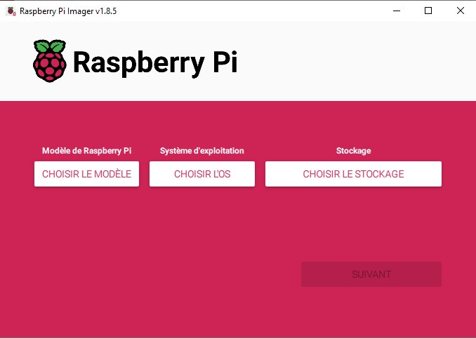

Une fois sur cette page, il y aura les 3 informations a mettre.
1. Le modele de la carte.
2. L'os que l'on veut.
3. Sur quel disque de stockage.
### Choix de la carte
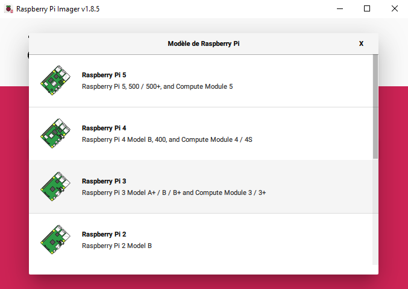

Pour ce tp, le raspberry pi 3 a été choisi.
### Choix de l'OS
Une fois dans le menu, choisir "use custom".

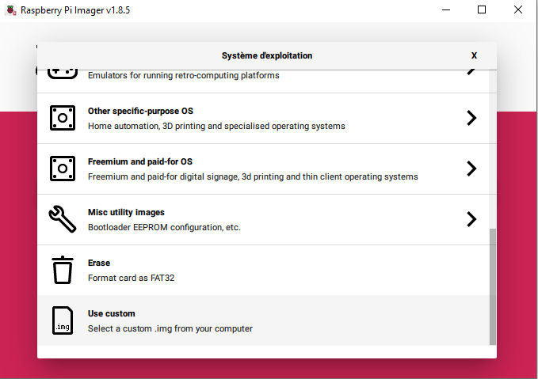

Une fois l'option selectionné, il faut prendre l'os suivant : 

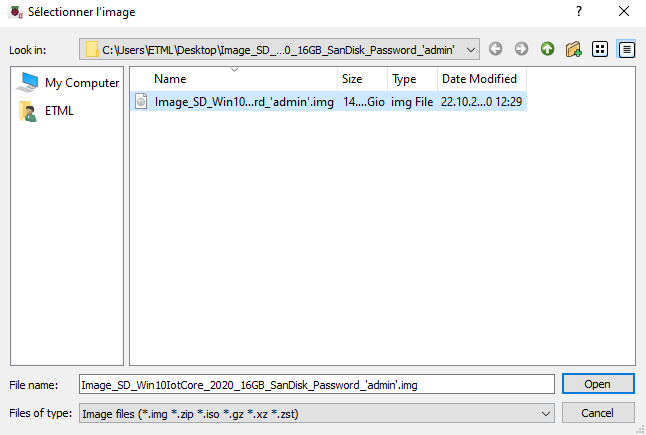

### Choix du stockage

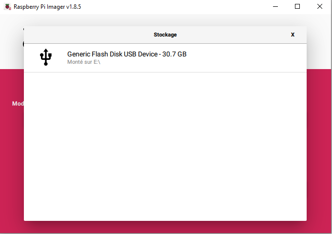

### Installation

Un menu s'ouvrira pour avoir des options suivante et il faudra prendre les suivantes : 

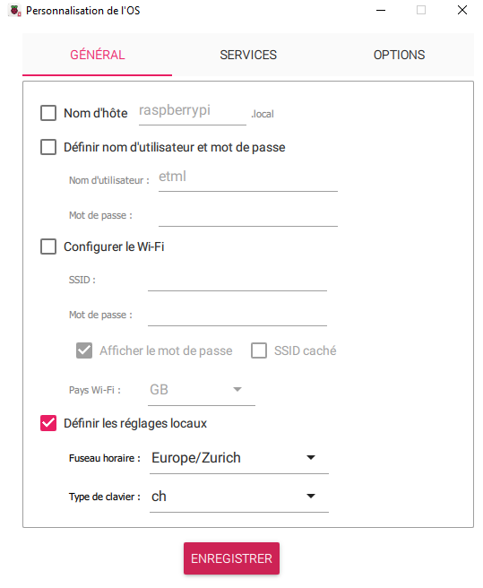

Et pour finir, il faut valider l'installation et attendre

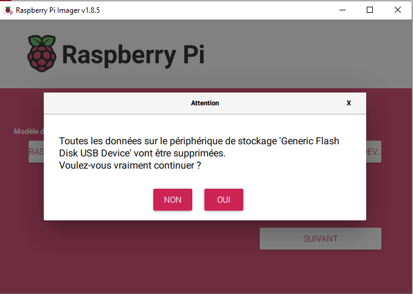

## Gestion du raspberry
Une fois l'installation de la carte SD effectuer, il la mettre dans la carte et allumer le raspberry.
Une fois cela fait, il faudra modifier l'orientation ainsi que la resolution pour pouvoir bien voir les choses.
Pour modifier ça, il faut se rendre sur l'interface web de notre raspberry.

Pour y aller, il faut entrer l'adresse ip de la meme maniere que suit. (http://10.228.134.51:8080/)
Pour trouver l'adresse IP, il faut aller sur la page d'accueil du raspberry et prendre l'ip comme suit : 
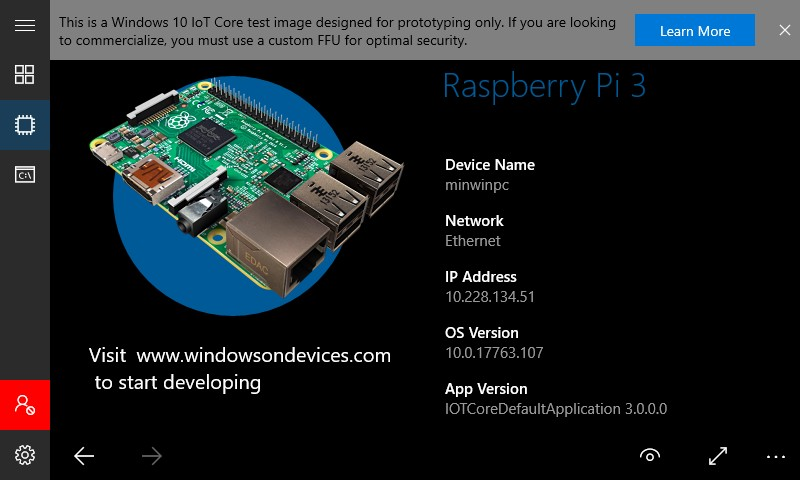

Le user name et mot de passe si non defini lors de l'installation seront administator nom et admin comme mdp

Ensuite, une fois sur la page suivante, mettre les memes informations sur la resolution et l'orientation.
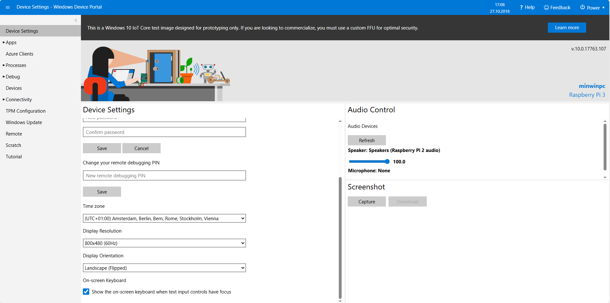

## Ping du raspberry
En etant sur un terminal windows, pour tester la connexion, nous avons fait un ping qui à bien fonctionner nous prouvant que la device était bien atteignable.

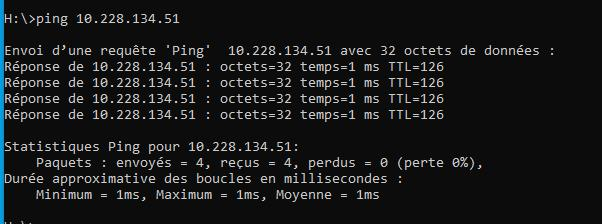
## Convertisseur de données 
### Mode d'emploi
#### Monnaie disponible
Les monnaies disponible sont les suivantes : 
  * Francs suisse / CHF
  * Réal brésilien / BRL
  * Peso Mexicain / MXN
  * Couronne norvégienne / NOK
#### Choix de la devise à convertir
Pour choisir la devise à convertir, il faut choisir dans la liste les 4 pays disponible :

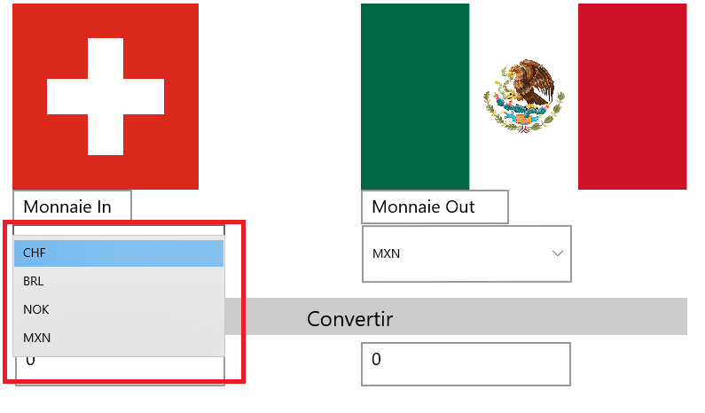

#### Choix de la devise à convertir
Pour choisir la devise que l'on veut avoir apres conversion, de la meme manière que la device a convertir, il faut choisir parmis les 4 pays disponible :

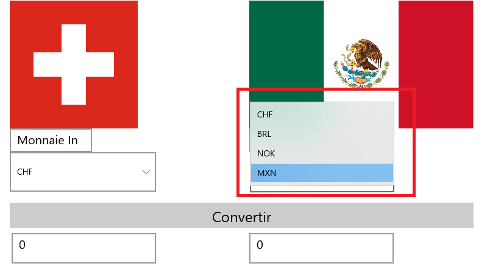

#### Ecriture de la somme a convertir
Pour ecrire la somme a convertir, il faut ecrire dans la zone de texte encardée en rouge ci dessous :

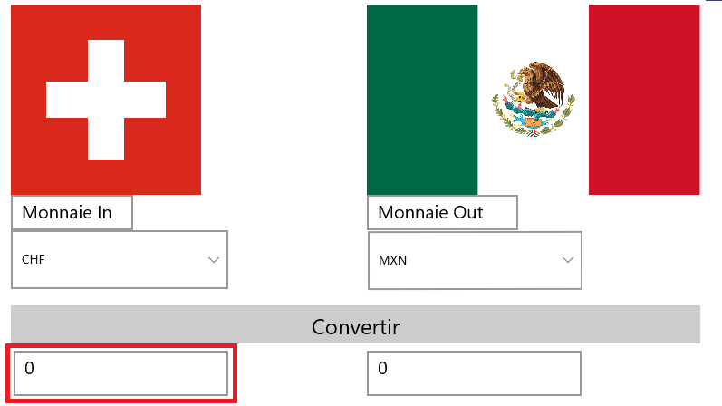

#### Conversion
Pour convertir les valeurs entrées, il faut cliqué sur le bouton convertir encardé en rouge ci-dessous :

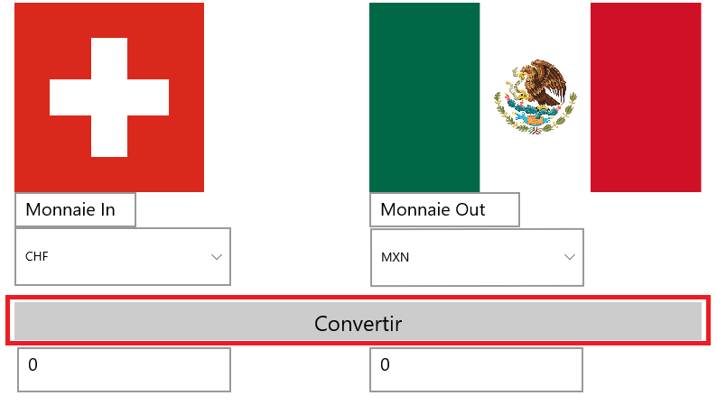

## Communiquation RS232
### Faire la communication
#### Hardware
Brancher le câble RS232 au PC et brancher l'adaptateur USB-RS232 à l'autre bout du câble RS232.
Brancher le connecteur USB de l'adaptateur au Raspberry Pi 3.
Brancher le câble Ethernet du réseau bleu au Raspberry Pi 3.

#### Sur l'écran
Sous Select Device, sélectionner le text de la partie haute du rectangle (\\?\FTDIBUS.....).
Une fois cela fait, appuyer sur Connect.
Sur PuTTY, sous "Serial", dans "Select a serial line", écrire "COM4" puis appuyer sur "open".

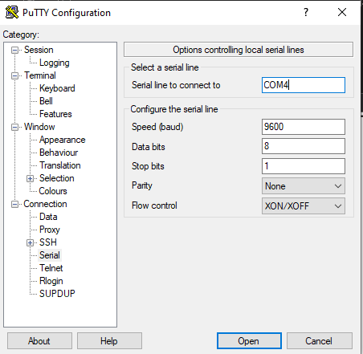

### Test du Read Data
Dans la pop-up ouverte par PuTTY, écrivez (rapidement) un mot ou une phrase (Par exemple : Je suis Kirian).
Cette dernière s'affichera dans le text box "Read Data".

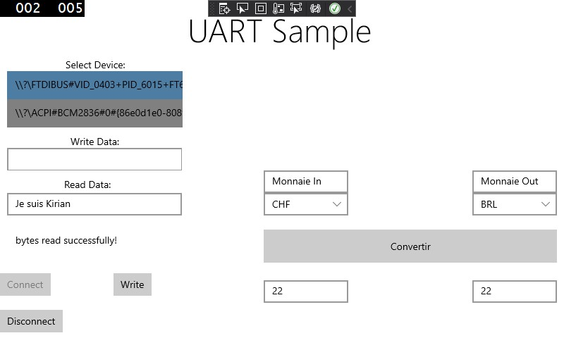

### Test du Write Data
Dans le text box "Write Data" écrivez un mot ou une phrase (par exemple : Toto) puis appuyez sur le bouton "Write".

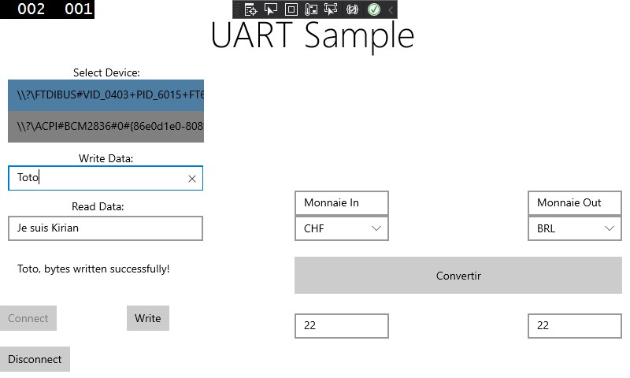

Une fois cela fait, vous pourrez voir sur PuTTY le mot ou la phrase écrit.

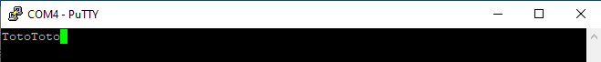

Nous avons implémenté l'application de conversion de devise dans l'aplication de communication via RS232.
Malheureusement la conversion n'arrive pas à se faire et les drapeaux des différents pays n'apparaissent pas lorsque l'on sélectionne leurs monnaies.
Nous arrivons a rentrer une valeur à convertir mais cette dernière est affichée tel quel dans le text box de la valeur convertie.
Ce sont les deux éléments qui ne fonctionnent pas dans cette application, ces problèmes n'apparaissent pas dans l'application de conversion de devises initiales.
Cette dernière est entierement fonctionnelle.
